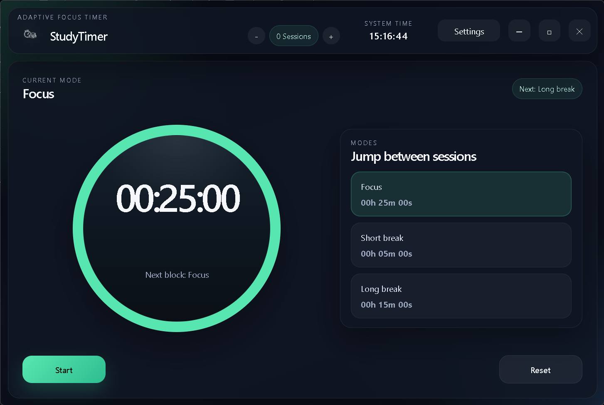

# StudyTimer



StudyTimer is a dark-themed desktop study timer built with Electron. It is designed for focused work sessions, break management, and quick manual session tracking, with configurable durations down to the second.

## Features

- Cross-platform desktop app setup for Windows, Linux, and macOS
- Custom frameless desktop UI with a dark theme
- Large central timer display
- Three modes:
  - Focus
  - Short break
  - Long break
- Configurable durations using hours, minutes, and seconds
- Runtime language switch between English and German
- Live system clock in the top bar
- Manual session counter controls with `+` and `-`
- Settings to decide which finished modes count as sessions
- Desktop notification and beep when a timer completes
- Custom app logo used in the window and packaged build
- Keyboard zoom shortcuts:
  - `Ctrl` / `Cmd` + `+`
  - `Ctrl` / `Cmd` + `-`
  - `Ctrl` / `Cmd` + `0`

## Project Structure

```text
StudyTimer/
|-- Logo.png
|-- LICENSE
|-- package.json
|-- package-lock.json
|-- README.md
`-- src/
    |-- main.js
    |-- preload.js
    `-- renderer/
        |-- app.js
        |-- index.html
        `-- styles.css
```

## Requirements

- Node.js 20+ recommended
- npm 10+ recommended

## Install

```bash
npm install
```

## Run In Development

```bash
npm start
```

## Build

Create an unpacked desktop build:

```bash
npm run pack
```

Create distributable packages:

```bash
npm run dist
```

Note: actual Linux and macOS package generation is most reliable on Linux/macOS or in CI running on those platforms.

## How It Works

### Modes

- Focus: default `25:00`
- Short break: default `05:00`
- Long break: default `15:00`

You can switch modes manually at any time.

### Session Counter

The session chip in the top bar shows the current total session count.

- Use `+` to increase the count manually
- Use `-` to decrease the count manually
- Use the settings checkboxes to decide which completed modes should automatically add `+1`

### Settings

Open the `Settings` button in the top bar to configure:

- Language
- Focus duration
- Short break duration
- Long break duration
- Which modes count as sessions

Changes are saved automatically in local app storage.

### Notifications

When a timer completes, the app:

- shows a desktop notification
- plays a system beep
- switches to the next appropriate mode

## Keyboard Shortcuts

- `Ctrl` / `Cmd` + `+`: zoom in
- `Ctrl` / `Cmd` + `-`: zoom out
- `Ctrl` / `Cmd` + `0`: reset zoom

## Packaging Notes

The app uses `electron-builder` for packaging. Current targets are configured in `package.json` for:

- Windows: `nsis`, `portable`
- Linux: `AppImage`, `deb`
- macOS: `dmg`, `zip`

## License

This project is licensed under the MIT License. See the `LICENSE` file for details.